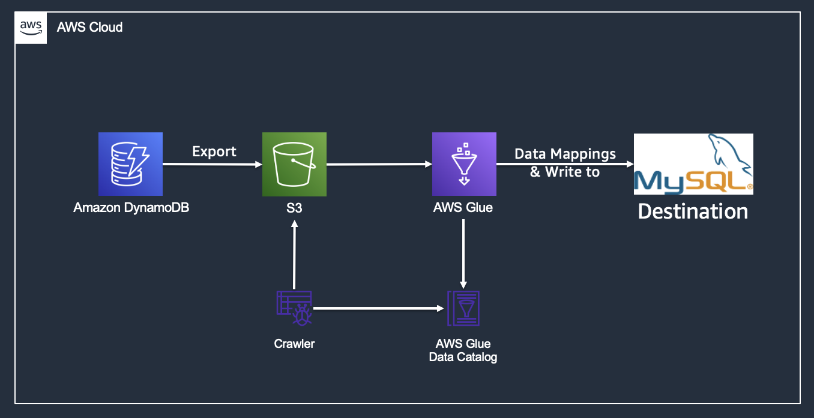
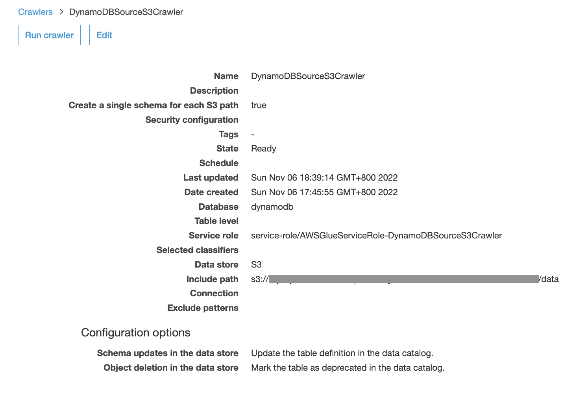
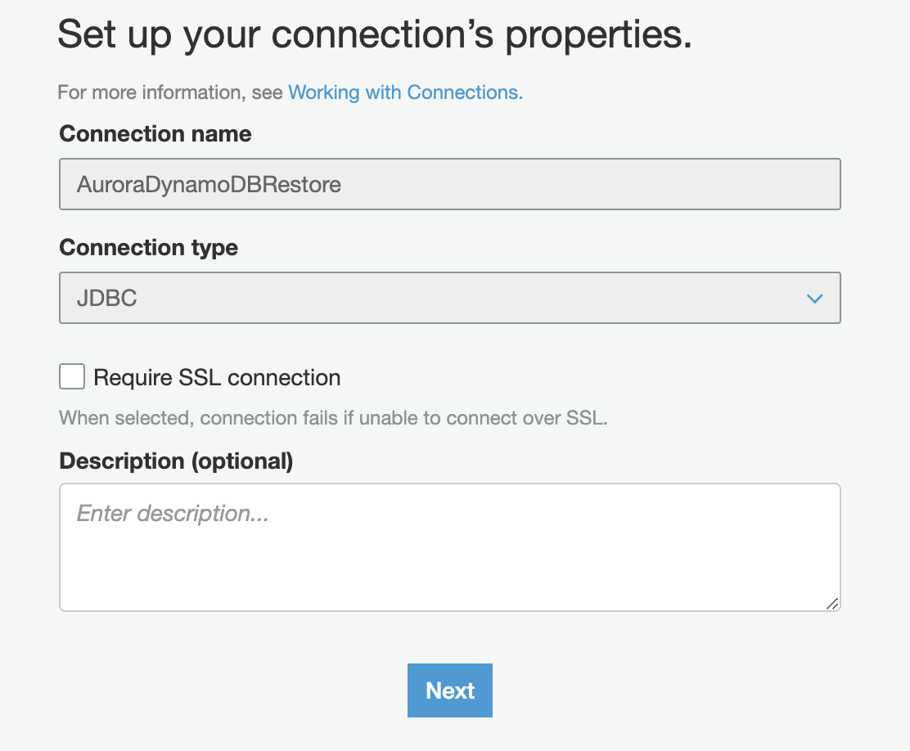
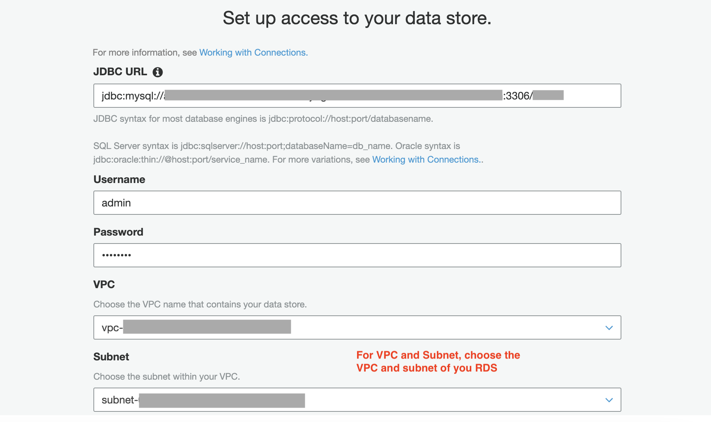
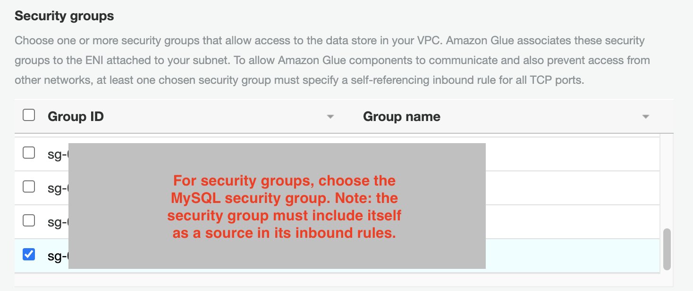
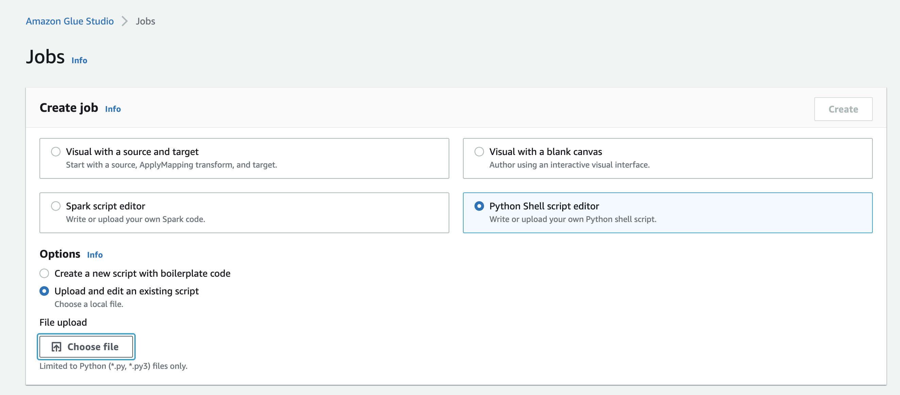
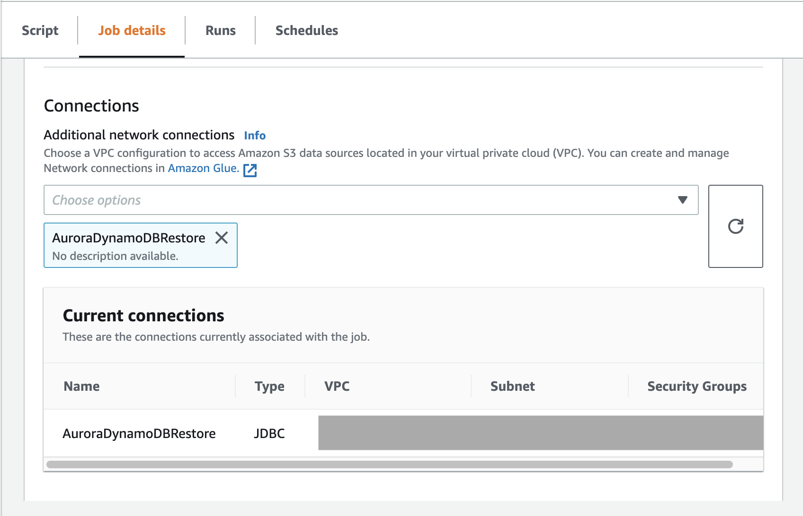

# Initial Data Migration From DynamoDB to Aurora/MySQL
## Backgroud
Customer wants to migrate data from DynamoDB to Aurora MySQL. This project will provide guidance on how to set up a glue job to load data into MySQL destination.

## Architecture

- Export DynamoDB table to S3
- Use Glue Crawler to crawl data and generate Glue table
- Perform mappings logic in Glue job
- Export data to MySQL using a Glue Connections



## Setup
### A. DynamoDB data preparation
1. Export DynamoDB table to S3 in json format [following guide here](https://docs.aws.amazon.com/amazondynamodb/latest/developerguide/S3DataExport_Requesting.html).
2. Create a Glue Crawler that crawler the S3 folder containing the exported json file.
3. Run Crawler to generate Glue table, take a note on the table name here. You will need to input it in your job script later.

### B. MySQL Connection setup
1. Download the [MySQL JDBC connector](https://www.mysql.com/products/connector/).
2. Pick MySQL connector .jar file (such as mysql-connector-java-8.0.19.jar) and upload it into your Amazon Simple Storage Service (Amazon S3) bucket.
3. Make a note of that path, because you are going to use it in the AWS Glue job to establish the JDBC connection with the database.
4. Create a Connections in Glue for MySQL connections.



5. Create VPC Endpoint for Glue to connect to the 

### C. Create Glue Job
1. Download ETL script
```
git clone https://github.com/Simone319/dynamodb-to-aurora.git
```
2. Change the parameters in `s3-to-mysql-script.py` to your own value.
   1. `your.mysql.host.here`
   2. `YourDatabase`
   3. `your-MySQL-table`
   4. `your-user-name`
   5. `your-password`
   6. `<path-to-connector>` (this is where you uploaded your MySQL connector .jar file in the previous step)
   7. `glue-database`
   8. `glue-table`
   9. Finally, change the data mappings logic as needed.
 
3. Set up and run Glue ETL job by uploading the script: `s3-to-mysql-script.py`.

4. In the *Job details*, expand *Advanced properties*, remember to add the Connections you just created.
